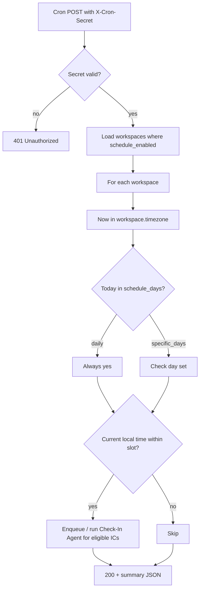

# Ceptly Technical Spec — Infrastructure & Check-In Scheduling

**Version:** 0.1  
**Status:** Draft  
**Derived from:** [prd.md](./prd.md)  
**Last Updated:** May 2026

This spec narrows the PRD into implementable decisions for **Render deployment**, **check-in scheduling**, and **manager-facing schedule controls**. It supersedes the PRD on job scheduling (Inngest → Render Cron Jobs).

---

## 1. Summary

Ceptly on Render needs three services:

| # | Render service | Purpose | Build order |
|---|----------------|---------|-------------|
| 1 | **Web Service** | Express backend API — Slack webhooks, agents, permissions, all DB access | **First** |
| 2 | **Postgres** | Primary data store | **Second** (connection string → backend env) |
| 3 | **Cron Job** | Hits an internal scheduler endpoint on a fixed cadence | **Third** (after web service is deployed) |

The Next.js app stays on **Vercel** and talks only to the Express API (unchanged from PRD §7).

**Scheduling model:** One Render cron job runs frequently (e.g. every 15 minutes). Each tick calls a secured internal endpoint; Express evaluates **per-workspace** schedule settings (days, local time, timezone) and triggers the Check-In Agent only for workspaces that are due.

Managers configure schedules in the web app — not in Render. Render only provides the clock.

---

## 2. Render Infrastructure

### 2.1 Web Service (Express)

- **Runtime:** Node.js + Express on Render
- **Responsibilities:**
  - Slack Bolt: events, slash commands, OAuth
  - Check-In, Synthesis, and Q&A agent orchestration
  - All permission checks (single trust boundary per PRD §7)
  - REST API for Vercel (auth, question sets, settings, roster)
  - Internal routes for cron-triggered work (`/internal/*`)
- **Not exposed:** Direct Postgres access from Vercel or the public internet

**Suggested service name:** `ceptly-api`  
**Example URL:** `https://ceptly-api.onrender.com`

### 2.2 Postgres

- **Provider:** Render managed Postgres
- **ORM:** Drizzle (per PRD)
- **Access:** Only from the Web Service (private connection string in env)
- **Setup:** Create DB → copy `DATABASE_URL` → set on Web Service → run migrations

### 2.3 Cron Job

- **Provider:** Render Cron Job (replaces Inngest for v1)
- **Rationale:** One fewer external dependency; sufficient for periodic scheduler ticks
- **Does not store per-team schedules** — only fires on a global cron expression

**Render cron configuration:**

| Field | Value |
|-------|--------|
| Method | `POST` |
| URL | `https://<your-api-host>/internal/checkin-scheduler` |
| Schedule | `*/15 * * * *` (every 15 minutes — recommended default) |
| Header | `X-Cron-Secret: <CRON_SECRET>` (must match backend env) |

**Why every 15 minutes?** Manager schedules are workspace-local times (e.g. Monday 09:00 in `America/Chicago`). A 15-minute poll gives ±7.5 minute accuracy without needing one Render cron per workspace. The scheduler compares “now” in each workspace timezone against configured day + time.

Alternative: `*/5 * * * *` for tighter windows at higher cron cost.

---

## 3. Internal Endpoint Security

`/internal/*` routes must not be callable by the public. Anyone with the URL could otherwise spam check-ins or digests.

### 3.1 Shared secret header

**Render cron job** sends:

```http
X-Cron-Secret: <value from CRON_SECRET env>
```

**Express** validates before any scheduler work:

```js
app.post('/internal/checkin-scheduler', async (req, res) => {
  if (req.headers['x-cron-secret'] !== process.env.CRON_SECRET) {
    return res.status(401).json({ error: 'Unauthorized' });
  }
  // run scheduler logic
});
```

### 3.2 Additional hardening (recommended)

- Reject non-`POST` on internal routes
- Do not document internal URLs in public OpenAPI
- Use a long random `CRON_SECRET` (32+ bytes)
- Optional: log and rate-limit repeated 401s from same IP

Same pattern applies to future internal routes (e.g. `/internal/synthesis-scheduler`).

---

## 4. Manager-Configurable Check-In Schedule

**Requirement:** A Monday 9am check-in may work for one team and be ignored by another. Schedule is **per workspace**, editable by founders/admins (and optionally team leads if product allows).

### 4.1 Settings UI (Next.js)

Location: **Settings** (or dedicated **Check-in schedule** section under workspace settings).

| Control | Type | Behavior |
|---------|------|----------|
| **Days of week** | Checkboxes | Mon, Tue, Wed, Thu, Fri (Sat/Sun optional — product decision: include all 7 or weekdays-only in v1) |
| **Time of day** | Time picker | Single daily anchor time, e.g. `09:00` |
| **Frequency** | Radio or segmented control | See §4.2 |
| **Timezone** | Select (searchable) | Workspace-level; used for all schedule math |

**Timezone onboarding:**

- Auto-detect from browser/`Intl` on first workspace setup
- Editable anytime in settings
- Display current local time preview: “Check-ins will run at 9:00 AM Central Time”

**Authorization:** Only `founder` / admin roles can save schedule (align with PRD permissions §5).

### 4.2 Frequency modes

| Mode | UI | Stored behavior |
|------|-----|-----------------|
| **Daily** | Frequency = Daily; day checkboxes disabled or ignored | Run at `time_local` every day |
| **Specific days** | Frequency = Specific days; enable day checkboxes | Run only on selected weekdays |
| **Custom** | Same as specific days — label in UI only | e.g. Mon + Thu = check Mon and Thu boxes |

Implementation: **Daily** vs **specific_days** is one enum; “custom” is not a separate backend mode — it is “specific_days” with any combination of checkboxes.

### 4.3 Defaults (new workspace)

Align with PRD Check-In Agent default:

- Days: Monday, Thursday
- Time: `09:00` local (Monday), `16:00` local (Thursday) — **open question:** single time vs per-day times in v1

**v1 recommendation:** Single `time_local` for all selected days (simpler UI). If product needs Mon 9am + Thu 4pm, add `times_by_day` in v1.1.

Until per-day times exist, default both days to `09:00` or use two preset slots only in copy, not in schema.

### 4.4 Check-in window (PRD §4.1)

PRD mentions “only between 9am–11am.” For v1:

- **Option A:** Window = scheduler tick granularity (15 min) — no extra UI
- **Option B:** Add optional `window_minutes` (e.g. 120) after `time_local` — defer unless needed

Spec default: **Option A** for MVP; document window as future enhancement.

---

## 5. Data Model Extensions

Extend PRD §6 for workspace schedule and cron audit.

```
Workspace
  id, name, slack_team_id, ...
  timezone          -- IANA string, e.g. "America/Chicago"
  schedule_frequency -- enum: daily | specific_days
  schedule_days     -- int[] weekday 0=Sun..6=Sat (Postgres integer array or JSON)
  schedule_time     -- time without TZ, e.g. "09:00" (local to workspace.timezone)
  schedule_enabled  -- boolean, default true
```

Optional:

```
SchedulerRun
  id, started_at, completed_at, workspaces_evaluated, checkins_triggered, error
```

**API types (frontend)** — add to `lib/api/types.ts` when implementing:

```ts
export type ScheduleFrequency = "daily" | "specific_days";

export interface WorkspaceSchedule {
  timezone: string;
  frequency: ScheduleFrequency;
  days_of_week: number[]; // 0-6, Sun-Sat
  time_local: string; // "HH:mm"
  enabled: boolean;
}
```

---

## 6. REST API (Vercel → Express)

All routes require auth; role check on mutating routes.

| Method | Path | Description |
|--------|------|-------------|
| `GET` | `/api/workspaces/:id/schedule` | Get current schedule + timezone |
| `PUT` | `/api/workspaces/:id/schedule` | Update schedule (founder/admin only) |
| `GET` | `/api/timezones` | Optional: list common IANA zones for picker |

**PUT body example:**

```json
{
  "timezone": "America/Chicago",
  "frequency": "specific_days",
  "days_of_week": [1, 4],
  "time_local": "09:00",
  "enabled": true
}
```

Validation:

- `time_local` matches `^([01]\d|2[0-3]):[0-5]\d$`
- `days_of_week` non-empty when `frequency === "specific_days"`
- `timezone` valid IANA (use `Intl` or timezone library)

---

## 7. Scheduler Logic (`POST /internal/checkin-scheduler`)

High-level flow each cron tick:



### 7.1 “Due now” algorithm

For each workspace with `schedule_enabled`:

1. Convert `now` (UTC) to `workspace.timezone`.
2. If `frequency === specific_days` and today's weekday ∉ `schedule_days`, skip.
3. Parse `schedule_time` as local HH:mm.
4. **Due** if local time is within `[schedule_time, schedule_time + tick_interval)`  
   - With 15-minute cron: due if `floor(now_local to 15m bucket) === floor(schedule_time to 15m bucket)` **or** simpler: `abs(minutes_since_midnight(now) - minutes_since_midnight(schedule)) < 15` and same calendar day.
5. **Idempotency:** Record last run per workspace per local date+slot (e.g. `last_checkin_schedule_fire_at`) so a duplicate cron tick in the same window does not double-DM ICs.

### 7.2 Check-In Agent invocation

When workspace is due:

- Load active question set version
- Load IC roster (not paused, opted in)
- Stagger Slack DMs if large team (PRD risk: rate limits)
- Persist `CheckIn` session stubs as needed

Synthesis / digest scheduling can follow the same pattern on a separate internal route in Phase 2.

---

## 8. Environment Variables

### Web Service (Express)

| Variable | Required | Description |
|----------|----------|-------------|
| `DATABASE_URL` | Yes | Render Postgres connection string |
| `CRON_SECRET` | Yes | Shared secret for `X-Cron-Secret` |
| `SLACK_*` | Yes | Bot token, signing secret, client id/secret (per Slack app) |
| `ANTHROPIC_API_KEY` | Yes | Claude for agents |
| `JWT_SECRET` / session secret | Yes | Vercel ↔ API auth |
| `FRONTEND_URL` | Yes | Vercel origin for OAuth redirects / CORS |

### Cron Job (Render)

| Setting | Value |
|---------|--------|
| `X-Cron-Secret` header | Same value as `CRON_SECRET` on Web Service |

### Vercel (Next.js)

| Variable | Description |
|----------|-------------|
| `NEXT_PUBLIC_API_URL` | Express base URL |

---

## 9. Build Order & Verification

### 9.1 Implementation order

1. **Express scaffold** — health check, Drizzle, migrations for `Workspace` + schedule fields  
   - Verify: `GET /health` returns 200 on Render  
2. **Postgres** — provision, migrate, seed one test workspace  
   - Verify: API reads/writes workspace row  
3. **Schedule API** — `GET`/`PUT` schedule endpoints + auth  
   - Verify: Vercel settings page saves and reloads schedule  
4. **Internal scheduler** — `POST /internal/checkin-scheduler` + secret check + due logic + idempotency  
   - Verify: manual `curl` with header triggers check-in for test workspace; without header → 401  
5. **Render Cron Job** — `*/15 * * * *` → production URL  
   - Verify: Render cron logs show 200; `SchedulerRun` or app logs show evaluations  
6. **Slack Check-In Agent** — wire scheduler to DM flow  

### 9.2 Acceptance criteria

- [ ] Founder can set Mon+Thu, 9:00 AM, workspace timezone in Settings UI  
- [ ] Changing timezone updates displayed preview without redeploying cron  
- [ ] Cron tick at wrong secret returns 401, no DMs sent  
- [ ] Cron tick at correct secret only DMs workspaces due in their local window  
- [ ] Same workspace not double-triggered within one 15-minute window  
- [ ] PRD tech stack table lists Render Cron Jobs, not Inngest  

---

## 10. Out of Scope (this spec)

- Per-day different times (Mon 9am, Thu 4pm) — v1.1 unless explicitly pulled into MVP  
- Per-user or per-sub-team schedules (PRD open question)  
- Inngest or other job queues  
- Synthesis cron (specify in Phase 2 spec addendum)  
- Email/Teams  

---

## 11. PRD Amendments

When this spec is accepted, update [prd.md](./prd.md):

| Section | Change |
|---------|--------|
| §4.1 Configuration | Reference workspace schedule UI (days, time, frequency, timezone) |
| §7 Tech Stack — Job Scheduling | **Inngest → Render Cron Jobs** |
| §8 MVP — Basic config UI | Explicitly include check-in schedule controls |
| §10 Phase 1 | Add Render Web Service + Postgres + cron wiring |

---

## 12. Open Questions

- [ ] Weekends in day picker for v1, or Mon–Fri only?  
- [ ] Single `time_local` vs per-weekday times for Mon 9am / Thu 4pm default  
- [ ] Can `lead` role edit schedule or founder-only?  
- [ ] Cron interval: 15 vs 5 minutes (cost vs precision)  
- [ ] Separate cron job for synthesis digest or same endpoint with `?job=digest`  
