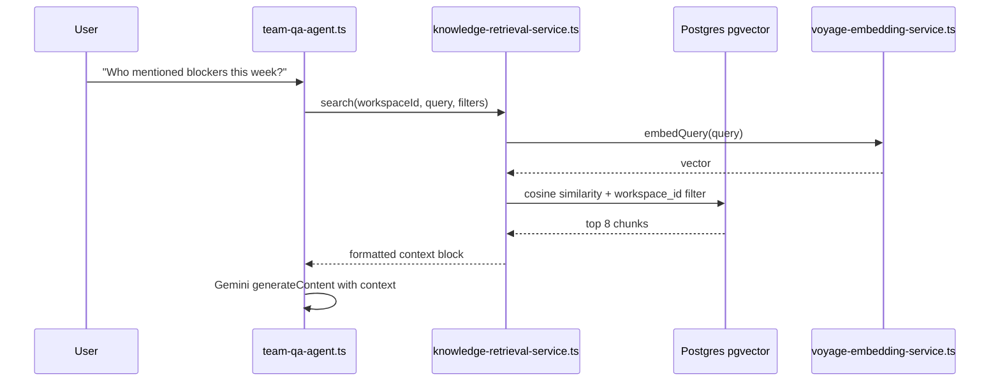
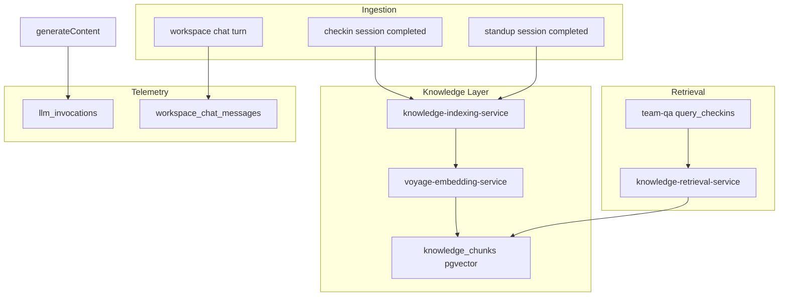

# Ceptly Intelligence Platform: Architecture Audit + 90-Day Plan

**Handoff context for Claude Code Opus 4.8.** All paths are absolute to the monorepo workspaces.

---

## STEP 1: Current State Architecture Report

### What Ceptly Actually Is Today

Ceptly is a **tool-augmented conversational agent platform**, not a RAG system. Intelligence is assembled at request time from:

1. **Hardcoded TypeScript prompt templates** (no external prompt registry)
2. **SQL-loaded transcripts** (time-bounded, keyword-filtered)
3. **Live PM tool API/MCP fetches** (Linear, Jira, Monday, ClickUp)
4. **Gemini function calling** for turns, proposals, and external mutations

**LLM stack:** Google Gemini only (`@google/genai`, default `gemini-2.5-flash`) via [`ceptly-backend/src/services/gemini-client.ts`](ceptly-backend/src/services/gemini-client.ts). No OpenAI, Anthropic, or Vercel AI SDK. Frontend ([`ceptly2`](ceptly2)) is a thin proxy—no LLM keys, no embeddings.

```mermaid
flowchart TB
  subgraph ui [User Surfaces]
    ChatUI["/chat — EmployeeChatPrompt"]
    SlackDM["Slack DMs — check-ins"]
    SlackCh["Slack channels — standups"]
    Activity["/activity — transcripts"]
  end

  subgraph agents [Gemini Agents]
    Router["chat-router.ts"]
    TeamQA["team-qa-agent.ts"]
    Checkin["checkin-conversation-agent.ts"]
    Standup["standup-turn-service.ts"]
    Setup["conversation-setup-agent.ts"]
    Adhoc["adhoc-conversation-agent.ts"]
  end

  subgraph store [PostgreSQL — Drizzle]
    SC["scheduled_conversations"]
    CS["checkin_sessions + checkin_messages"]
    ST["standups + standup_sessions + standup_session_messages"]
  end

  subgraph ctx [Context — NOT vector]
    SQL["checkin-context-service.ts"]
    PM["linear/jira/monday/clickup APIs"]
    MCP["Linear + Slack MCP"]
  end

  ChatUI --> Router --> Setup and TeamQA and Adhoc
  SlackDM --> Checkin --> CS
  SlackCh --> Standup --> ST
  TeamQA --> SQL and MCP and PM
  Checkin --> PM
  Standup --> PM
  Deploy["agent-service.ts"] --> SC and ST
```

### How Agents Are Created

Unified API in [`ceptly-backend/src/services/agent-service.ts`](ceptly-backend/src/services/agent-service.ts) maps three product kinds to **two physical tables**:

| Kind       | Table                                        | Trigger              |
| ---------- | -------------------------------------------- | -------------------- |
| `checkin`  | `scheduled_conversations` (`kind=scheduled`) | cron schedule        |
| `reachout` | `scheduled_conversations` (`kind=adhoc`)     | manual / chat commit |
| `standup`  | `standups`                                   | cron schedule        |

Config columns: `agent_persona`, `conversation_goal`, `agent_notes`, `context_integrations[]`, `result_destinations` (jsonb).

**Founder chat agents** (not deployed until committed): `conversation_setup`, `team_qa`, `adhoc_conversation`, `channel_standup` — routed by [`chat-router.ts`](ceptly-backend/src/services/chat-router.ts).

### How Conversations Are Stored

| Surface              | Persisted? | Storage                                                                                                                 |
| -------------------- | ---------- | ----------------------------------------------------------------------------------------------------------------------- |
| Slack DM check-ins   | **Yes**    | `checkin_sessions` → `checkin_messages`                                                                                 |
| Channel standups     | **Yes**    | `standup_sessions` → `standup_session_messages`                                                                         |
| Legacy Q&A check-ins | **Yes**    | `checkin_responses` + `conversation_questions`                                                                          |
| Standup summaries    | **Yes**    | `standup_sessions.summary_text`                                                                                         |
| Founder `/chat` UI   | **No**     | React state only; 40-msg cap sent per request                                                                           |
| Slack @mention chat  | **No**     | In-memory `TtlCache` 24h ([`slack-channel-chat-service.ts`](ceptly-backend/src/services/slack-channel-chat-service.ts)) |
| Leadership synthesis | **No**     | Generated + posted to Slack; not stored ([`synthesis-service.ts`](ceptly-backend/src/services/synthesis-service.ts))    |
| PM tool snapshots    | **No**     | Fetched live per turn from APIs                                                                                         |
| Tool call traces     | **No**     | SSE `tool_start`/`tool_end` to UI only ([`chat-events.ts`](ceptly-backend/src/services/chat-events.ts))                 |
| LLM token usage      | **No**     | Never read from Gemini `usageMetadata`                                                                                  |

**Critical gap:** Your richest founder interactions and synthesis outputs are **ephemeral**. This is the #1 blocker to a data moat.

### How Prompts Are Constructed

All prompts are inline TypeScript strings passed as Gemini `contents` user messages or `systemInstruction`:

- **DM check-ins:** [`checkin-conversation-agent.ts`](ceptly-backend/src/services/checkin-conversation-agent.ts) — `buildOpeningPrompt()`, `buildTurnPrompt()`
- **Standups:** [`standup-turn-service.ts`](ceptly-backend/src/services/standup-turn-service.ts) — `buildStandupPrompt()`
- **Team Q&A:** [`team-qa-agent.ts`](ceptly-backend/src/services/team-qa-agent.ts) — `buildSystemPrompt()`
- **Setup/adhoc/standup chat:** respective `*-agent.ts` files
- **Synthesis:** [`synthesis-service.ts`](ceptly-backend/src/services/synthesis-service.ts), [`standup-synthesis-service.ts`](ceptly-backend/src/services/standup-synthesis-service.ts)

Helpers: [`agent-datetime-context.ts`](ceptly-backend/src/lib/agent-datetime-context.ts), [`supported-languages.ts`](ceptly-backend/src/lib/supported-languages.ts), [`scrum-master-preset.ts`](ceptly-backend/src/constants/scrum-master-preset.ts).

### How Context Is Assembled (Current "Retrieval")

The closest thing to RAG is [`checkin-context-service.ts`](ceptly-backend/src/services/checkin-context-service.ts):

```29:78:ceptly-backend/src/services/checkin-context-service.ts
export async function loadCheckinContextEntries(
  workspaceId: string,
  options?: { days?: number; limit?: number; includeInProgress?: boolean },
): Promise<CheckinContextEntry[]> {
  // ... SQL: last N days, max 80 sessions, ordered by started_at DESC
  // ... N+1 query: load all messages per session
}
```

Used by:

- `query_checkins` tool in [`team-qa-agent.ts`](ceptly-backend/src/services/team-qa-agent.ts) — **substring keyword match** via `entryMatchesKeyword()`
- [`synthesis-service.ts`](ceptly-backend/src/services/synthesis-service.ts) — loads all entries for digest generation

PM context: [`conversation-context-service.ts`](ceptly-backend/src/services/conversation-context-service.ts) → `buildMemberContextFacts()` loads live snapshots per roster email.

### How Tools Work

Gemini `FunctionDeclaration` objects co-located per service. No central registry.

**Ceptly-native tools:** `checkin_turn`, `standup_turn`, `query_checkins`, `submit_*_plan`, `select_chat_agent`

**External tools:** Linear/Jira/Monday/ClickUp CRUD + Slack MCP read tools (Team Q&A only)

Multi-round loops: Team Q&A (`MAX_TOOL_ROUNDS = 5`), standup turns, integration check-ins.

### Database (19 tables, no vectors)

Full schema in [`ceptly-backend/src/db/schema/`](ceptly-backend/src/db/schema/). Postgres on Render via Drizzle. Migrations in [`ceptly-backend/drizzle/`](ceptly-backend/drizzle/) (0000–0036).

Relevant indexes already exist:

- `idx_checkin_messages_session_role` on `(session_id, role)`
- `idx_standup_session_messages_session` on `(session_id, created_at)`

### Telemetry

- HTTP slow-request logs ([`request-timing.ts`](ceptly-backend/src/lib/request-timing.ts))
- `withTiming()` console labels
- SSE tool events to frontend
- **No** product analytics, **no** LLM observability, **no** eval logging

### Where Intelligence Exists vs. Does Not

| Exists                                        | Does Not Exist                           |
| --------------------------------------------- | ---------------------------------------- |
| Full Slack DM/channel transcripts in Postgres | Vector embeddings / semantic search      |
| Agent persona/goal/notes config               | Long-term memory tables                  |
| Time-bounded SQL history load                 | Workspace chat persistence               |
| Live PM tool snapshots                        | PM snapshot caching                      |
| Standup session summaries                     | Synthesis output storage                 |
| Keyword filter on check-ins                   | User feedback / corrections              |
| Sanitization anti-hallucination rules         | Evaluation framework                     |
| Tool calling with SSE visibility              | Tool trace persistence                   |
| Leadership attention heuristics               | Learning flywheel / fine-tuning pipeline |

---

## STEP 2: Ranked Knowledge Opportunity List

For each source: **R**=retrieval, **M**=memory, **T**=training, **E**=evaluation

| Rank   | Source                            | Location                                            | R   | M   | T   | E   | Notes                                                                   |
| ------ | --------------------------------- | --------------------------------------------------- | --- | --- | --- | --- | ----------------------------------------------------------------------- |
| **1**  | Check-in DM transcripts           | `checkin_messages`                                  | ★★★ | ★★★ | ★★★ | ★★★ | Richest proprietary data; already loaded by `loadCheckinContextEntries` |
| **2**  | Standup channel transcripts       | `standup_session_messages`                          | ★★★ | ★★  | ★★★ | ★★★ | Not in Team Q&A today — major gap                                       |
| **3**  | Standup summaries                 | `standup_sessions.summary_text`                     | ★★★ | ★★  | ★★  | ★★  | Pre-digested; cheap to embed                                            |
| **4**  | Agent config                      | `agent_persona`, `conversation_goal`, `agent_notes` | ★★  | ★★★ | ★   | ★   | Org/agent memory seed                                                   |
| **5**  | Legacy Q&A responses              | `checkin_responses`                                 | ★★  | ★   | ★★★ | ★★  | Structured Q→A pairs for SFT                                            |
| **6**  | Conversation run rollups          | `conversation-results-service.ts`                   | ★★  | ★   | ★★  | ★★  | Responded/missing metadata                                              |
| **7**  | PM tool API responses             | ephemeral in turn services                          | ★★★ | ★   | ★★  | ★   | **Not stored** — cache opportunity                                      |
| **8**  | Slack MCP search results          | ephemeral in Team Q&A                               | ★★  | ★   | ★★  | ★   | **Not stored**                                                          |
| **9**  | Synthesis digests                 | Slack posts only                                    | ★★★ | ★★  | ★★  | ★★  | **Must persist going forward**                                          |
| **10** | Workspace chat (`/chat`)          | ephemeral                                           | ★★  | ★★  | ★★★ | ★★★ | **Must persist** — setup intent gold                                    |
| **11** | Tool call traces                  | SSE only                                            | ★   | ★   | ★★★ | ★★★ | Tool-selection training data                                            |
| **12** | Attention dismissals              | `activity_attention_dismissals`                     | ★   | ★   | ★   | ★★  | Weak negative signal                                                    |
| **13** | User feedback                     | **none**                                            | —   | ★★★ | ★★★ | ★★★ | **Must build**                                                          |
| **14** | Roster metadata                   | `roster_members`                                    | ★   | ★★★ | ★   | ★   | Timezone, display name                                                  |
| **15** | OAuth tokens / workspace settings | `workspaces`                                        | —   | ★   | —   | —   | Integration context, not content                                        |

**Immediate ROI:** Embed ranks 1–3 and wire into `query_checkins`. Persist ranks 9–11.

---

## STEP 3: Minimal RAG System (Solo Founder, Max ROI)

### LLM + Embedding Provider Strategy

**Current reality:** Ceptly runs on Gemini **free tier**. Your dashboard shows `gemini-2.5-flash` at **17/20 RPD** — you are one bad day from hard rate-limit failures. Free tier is fine for dev; it cannot support production agent workloads.

**Target architecture:** decouple **generation** from **embeddings**.

| Layer | Now (free/dev) | Target (production) | Changes when migrating |
| ----- | -------------- | ------------------- | ---------------------- |
| **Generation** | Gemini free tier (`@google/genai`) | **Anthropic Claude** (`@anthropic-ai/sdk`) | Refactor `gemini-client.ts` → provider abstraction; ~18 `generateContent` call sites |
| **Embeddings** | **Voyage `voyage-4-lite`** (hosted API) | Same — no change | None — pgvector index stays valid |
| **Vector store** | pgvector on Render Postgres | Same | None |

**Why Voyage for embeddings (yes, use it):**

1. **Anthropic has no embedding model** — Voyage is the standard Claude + RAG pairing (Anthropic documents Voyage as the recommended embedding partner).
2. **Decoupled from Gemini** — when you switch generation to Claude, you do not re-index. If you embed with Gemini now, you must re-embed everything on migration.
3. **200M free tokens** on `voyage-4-lite` — effectively $0 embedding cost for years at Ceptly scale (vs. burning scarce Gemini free-tier RPD on embed calls).
4. **Does not compete with your Gemini quota** — RAG indexing and query embeds stay off the 20 RPD flash limit.
5. **Hosted API, not nano** — one `fetch` from Node.js; no GPU worker. Use `voyage-4-lite` @ 512d, not self-hosted `voyage-4-nano`.

**Do not use Gemini for embeddings if Anthropic is the plan.** Same free-tier trap, vendor lock-in, and forced re-index later.

**Anthropic migration scope (separate workstream, Month 2–3):**

- Add `llm-provider.ts` abstraction with `generateWithTools()` interface
- Implement `AnthropicProvider` (Claude Sonnet for chat/Q&A, Haiku for routing/summaries)
- Keep `GeminiProvider` as fallback during transition
- Env: `ANTHROPIC_API_KEY`, `LLM_PROVIDER=anthropic|gemini`
- **Embeddings unchanged** — `voyage-embedding-service.ts` is provider-agnostic

### Recommendation

| Component             | Choice                                                                                       | Why                                                          |
| --------------------- | -------------------------------------------------------------------------------------------- | ------------------------------------------------------------ |
| **Embedding model**   | **`voyage-4-lite` @ 512d** via Voyage API (`VOYAGE_API_KEY`)                               | Free 200M tokens; decoupled from LLM; survives Anthropic migration |
| **Vector store**      | **pgvector** on existing Render Postgres                                                     | Zero new infra; Drizzle-compatible; workspace-scoped queries |
| **Chunking**          | **One chunk per completed session** (defer message-window chunks)                            | Halves embed cost vs. 2-chunk plan; sufficient for typical check-in length |
| **Metadata**          | `workspace_id`, `source_type`, `source_id`, `member_id`, `conversation_id`, `date`, `status` | Enables filtered retrieval                                   |
| **Retrieval**         | **Hybrid:** keyword first → semantic fallback; top-k=8 + metadata pre-filter                 | Avoids embed API on easy queries                             |
| **Re-ranking**        | **None in v1**; optional cross-encoder in v2                                                 | Saves latency/cost; transcripts are short                    |
| **Ingestion trigger** | Async on `appendMessage` / `appendSessionMessage` + nightly backfill job                     | Event-driven, no batch ETL complexity                        |

### Chunking Strategy (cost-optimized)

```
Chunk types (v1 — one embed per session):
1. session_summary — one chunk per completed checkin/standup session
   content: formatted transcript block (reuse formatTranscriptEntry())
   metadata: member, conversation, goal, status, dates
   skip if: fewer than 3 messages

2. standup_summary — standup_sessions.summary_text when present (separate small chunk)
   metadata: standup_id, session_id, channel_id

Deferred to v2 (only if eval shows recall gaps on long sessions):
- message_window — sliding 4-message windows for sessions >10 messages
```

Target: ~500–1500 tokens/chunk. No recursive text splitting needed for Ceptly's typical message lengths.

### Retrieval Architecture



### Integration Points (exact files)

1. **New service:** `ceptly-backend/src/services/knowledge-retrieval-service.ts`
2. **New service:** `ceptly-backend/src/services/knowledge-indexing-service.ts`
3. **Hook ingestion** in:
   - [`checkin-service.ts`](ceptly-backend/src/services/checkin-service.ts) `appendMessage()` — index on session complete
   - [`standup-session-service.ts`](ceptly-backend/src/services/standup-session-service.ts) `appendSessionMessage()` — index on session complete
   - [`standup-synthesis-service.ts`](ceptly-backend/src/services/standup-synthesis-service.ts) — index summary
4. **Replace keyword search** in [`team-qa-agent.ts`](ceptly-backend/src/services/team-qa-agent.ts) `executeQueryCheckins()` — add `semantic_query` param; fall back to keyword if embedding unavailable
5. **Optional v1.5:** Pre-fetch top-3 chunks in [`checkin-conversation-agent.ts`](ceptly-backend/src/services/checkin-conversation-agent.ts) `buildTurnPrompt()` for cross-member context ("others mentioned X")

### Cost Analysis (What Actually Costs Money)

**The good news:** RAG embeddings are a rounding error compared to what you already spend on Gemini generation for check-in turns, standup turns, Team Q&A tool loops, and synthesis. Cost worry should focus on *new* LLM calls the plan adds (memory extraction, re-ranking), not pgvector or embeddings.

#### Current spend (already happening — no RAG)

| Workload | Typical tokens/call | Calls/day (50-workspace scale) | Relative cost |
| -------- | ------------------- | ------------------------------ | ------------- |
| Check-in turn loop | 2–8K in, 200–500 out × 5–10 turns/session | ~200–500 sessions/day | **Highest** |
| Standup turn loop | 3–10K in × 3–8 turns/session | ~50 sessions/day | **High** |
| Team Q&A (tool rounds) | 5–30K in × up to 5 rounds | ~20–100 queries/day | **High** |
| Synthesis / standup summary | 10–40K in | ~10–50/day | Medium |
| Founder chat (setup/adhoc) | 2–10K per turn | Variable | Medium |

At `gemini-2.5-flash` (~$0.15/M input, ~$0.60/M output), a single multi-turn check-in session is roughly **$0.002–0.01**. That is 100–1000× more than embedding that same session once.

#### New RAG/infrastructure spend (Month 1)

| Item | Unit cost | Early scale (10 workspaces, ~500 sessions/mo) | Growth scale (100 workspaces, ~5K sessions/mo) |
| ---- | --------- | --------------------------------------------- | ---------------------------------------------- |
| **Embed on session complete** (1 chunk/session, ~1.5K tokens) | $0.15/M tokens | **~$0.11/mo** | **~$1.13/mo** |
| **Query embed** (`query_checkins`, ~50 tokens/query, 500 queries/mo) | $0.15/M tokens | **~$0.004/mo** | **~$0.04/mo** |
| **pgvector storage** (512d × 4 bytes × 1 chunk/session) | Included in Render Postgres | **<1 MB** | **~10 MB** |
| **Backfill one-time** (10K historical sessions × 1.5K tokens) | $0.15/M tokens | **~$2.25 once** | N/A |

**Month 1 RAG total at early scale: ~$0.15/mo ongoing + ~$2 backfill once.**

#### New spend to watch (Month 2+)

| Item | Risk | Mitigation |
| ---- | ---- | ---------- |
| Memory extraction (1 Gemini call/session) | Could add ~$0.001–0.003 per completed session | **Defer to Month 2; batch weekly; skip sessions <3 messages** |
| Re-ranking with Gemini | +1 LLM call per Team Q&A query | **Never in v1; only if eval proves necessary** |
| Pre-fetch RAG in every check-in turn | +1 embed + retrieval per DM turn | **Defer to v1.5; opt-in per agent** |
| PM snapshot cache | Postgres rows only | Cheap; reduces API rate limits, not LLM cost |

#### Embedding model cost comparison

| Model | How | Cost at Ceptly scale | Survives Anthropic migration | Verdict |
| ----- | --- | -------------------- | ---------------------------- | ------- |
| **`voyage-4-lite` @ 512d** | Voyage API | **$0** (200M free tokens) | **Yes — no re-index** | **Default** |
| `gemini-embedding-001` @ 768d | Gemini API | Free tier RPD cost | **No — must re-index** | Avoid |
| `voyage-4-nano` self-hosted | GPU/CPU worker | $0 API, $20+/mo infra | Yes but overkill | Avoid |

### Cost Controls (built into implementation)

1. **One chunk per session** — index on `status → completed` only, not every `appendMessage`. Reuse `formatTranscriptEntry()` as a single blob. No message-window chunks until sessions routinely exceed 10 messages.
2. **Skip trivial sessions** — do not embed sessions with fewer than 3 messages or empty transcripts.
3. **Hybrid retrieval** — run existing keyword filter first; call embed API only when keyword returns 0 results OR agent passes explicit `semantic_query`. Saves embed calls on easy queries.
4. **512 dimensions** — Voyage MRL default; smaller pgvector footprint than 768/3072.
5. **Backfill throttle** — `scripts/backfill-knowledge-index.ts` processes 50 sessions/batch with 1s delay; run off-peak. Estimated backfill for 10K sessions: ~$2 total.
6. **`llm_invocations` budget alerts** — log every Gemini call; add optional `WORKSPACE_MONTHLY_LLM_BUDGET_USD` env guard in Month 1 telemetry wrapper.
7. **Defer paid-adjacent features** — memory extraction, re-ranking, check-in pre-fetch stay out of Month 1 scope.
8. **No new infrastructure** — pgvector on existing Postgres; no Pinecone, no embedding worker, no Redis.

### Operating Cost Estimate (summary)

- **Month 1 RAG add-on:** ~$0.10–2/mo at current scale; one-time backfill ~$2
- **Month 1 total AI (existing + RAG):** dominated by check-in/standup generation, not embeddings
- **Break-even:** semantic Team Q&A that prevents one unnecessary tool round (~5K tokens) pays for ~100 embedding calls

---

## STEP 4: Memory System Design

Three scopes, one table pattern (simplicity over normalization):

### Schema: `knowledge_memories`

```sql
-- Migration: 0037_knowledge_platform.sql

CREATE EXTENSION IF NOT EXISTS vector;

CREATE TYPE memory_scope AS ENUM ('user', 'agent', 'organization');
CREATE TYPE memory_source AS ENUM ('extracted', 'explicit', 'inferred');

CREATE TABLE knowledge_chunks (
  id UUID PRIMARY KEY DEFAULT gen_random_uuid(),
  workspace_id UUID NOT NULL REFERENCES workspaces(id) ON DELETE CASCADE,
  source_type TEXT NOT NULL, -- 'checkin_session' | 'standup_session' | 'standup_summary' | 'synthesis'
  source_id UUID NOT NULL,
  chunk_index SMALLINT NOT NULL DEFAULT 0,
  content TEXT NOT NULL,
  embedding vector(512),
  metadata JSONB NOT NULL DEFAULT '{}',
  created_at TIMESTAMPTZ NOT NULL DEFAULT now(),
  UNIQUE (workspace_id, source_type, source_id, chunk_index)
);

CREATE INDEX idx_knowledge_chunks_workspace ON knowledge_chunks (workspace_id);
CREATE INDEX idx_knowledge_chunks_embedding ON knowledge_chunks
  USING ivfflat (embedding vector_cosine_ops) WITH (lists = 100);

CREATE TABLE knowledge_memories (
  id UUID PRIMARY KEY DEFAULT gen_random_uuid(),
  workspace_id UUID NOT NULL REFERENCES workspaces(id) ON DELETE CASCADE,
  scope memory_scope NOT NULL,
  scope_id UUID, -- roster_member_id | scheduled_conversation_id/standup_id | NULL for org
  key TEXT NOT NULL, -- e.g. 'preferred_standup_time', 'blocker_pattern', 'communication_style'
  value TEXT NOT NULL,
  confidence REAL NOT NULL DEFAULT 0.5,
  source memory_source NOT NULL DEFAULT 'extracted',
  source_ref UUID, -- session_id or chat_id that produced this
  expires_at TIMESTAMPTZ,
  created_at TIMESTAMPTZ NOT NULL DEFAULT now(),
  updated_at TIMESTAMPTZ NOT NULL DEFAULT now(),
  UNIQUE (workspace_id, scope, scope_id, key)
);

CREATE INDEX idx_knowledge_memories_lookup
  ON knowledge_memories (workspace_id, scope, scope_id);
```

### A. User Memory (roster member scope)

**Extract from:** completed check-in transcripts where `role=user`

**Examples:**

- Recurring blockers ("often blocked on code review")
- Work patterns ("usually ships on Thursdays")
- Communication preferences (inferred from response length/timing)

**Extraction:** Post-session Gemini structured output (cheap, one call per completed session):

```typescript
// knowledge-extraction-service.ts
interface ExtractedUserFacts {
  facts: { key: string; value: string; confidence: number }[];
}
// Prompt: "Extract durable facts about this person from this check-in. Max 5 facts."
```

**Retrieval:** Inject into `buildTurnPrompt()` when `roster_member_id` matches:

```typescript
const userMemories = await loadMemories(workspaceId, "user", rosterMemberId);
// Append to prompt: "## Known about {name}\n- {key}: {value}"
```

**Update:** Upsert on `UNIQUE (workspace_id, scope, scope_id, key)` with confidence decay for contradictions.

### B. Agent Memory (per scheduled_conversation / standup)

**Extract from:** agent deploy config + observed session outcomes

**Examples:**

- "This check-in consistently surfaces deployment blockers"
- Effective question phrasings that got detailed answers
- Which integrations were actually referenced in sessions

**Retrieval:** Inject via `formatAgentNotesBlock()` in [`checkin-conversation-agent.ts`](ceptly-backend/src/services/checkin-conversation-agent.ts)

**Update:** Weekly batch job aggregating session stats per agent.

### C. Organization Memory (workspace scope)

**Extract from:** standup summaries, synthesis outputs, cross-member patterns

**Examples:**

- "Team uses Linear for sprint tracking, Jira for bugs"
- "Weekly release cadence on Fridays"
- Glossary / project codenames mentioned repeatedly

**Retrieval:** Inject into Team Q&A system prompt and synthesis prompts.

**Update:** After each standup summary generation + weekly synthesis.

---

## STEP 5: Data Flywheel Design

### Signals Already Generated (but lost or underused)

| Signal                      | Current State               | Flywheel Action                            |
| --------------------------- | --------------------------- | ------------------------------------------ |
| Completed check-in sessions | Stored                      | Index + extract memories                   |
| Abandoned sessions          | Stored (`status=abandoned`) | Negative eval examples                     |
| Missing responses           | Computed in results         | Eval: "did agent follow up appropriately?" |
| Tool calls                  | SSE only                    | Persist to `llm_tool_calls`                |
| Gemini requests             | Not logged                  | Persist to `llm_invocations`               |
| Synthesis posts             | Slack only                  | Persist to `synthesis_outputs`             |
| Workspace chat              | Ephemeral                   | Persist to `workspace_chat_sessions`       |
| User corrections            | None                        | Add thumbs-down + optional correction text |
| Repeated questions          | Detectable post-persistence | Cluster → FAQ chunks                       |
| PM snapshot fetches         | Ephemeral                   | Cache to `integration_snapshots` (24h TTL) |

### New Tables for Flywheel

```sql
CREATE TABLE workspace_chat_sessions (
  id UUID PRIMARY KEY DEFAULT gen_random_uuid(),
  workspace_id UUID NOT NULL REFERENCES workspaces(id) ON DELETE CASCADE,
  user_id UUID NOT NULL REFERENCES users(id),
  agent_id TEXT, -- ChatAgentId
  created_at TIMESTAMPTZ NOT NULL DEFAULT now(),
  updated_at TIMESTAMPTZ NOT NULL DEFAULT now()
);

CREATE TABLE workspace_chat_messages (
  id UUID PRIMARY KEY DEFAULT gen_random_uuid(),
  session_id UUID NOT NULL REFERENCES workspace_chat_sessions(id) ON DELETE CASCADE,
  role TEXT NOT NULL CHECK (role IN ('user', 'assistant')),
  content TEXT NOT NULL,
  agent_id TEXT,
  proposal JSONB,
  created_at TIMESTAMPTZ NOT NULL DEFAULT now()
);

CREATE TABLE llm_invocations (
  id UUID PRIMARY KEY DEFAULT gen_random_uuid(),
  workspace_id UUID NOT NULL,
  agent_name TEXT NOT NULL, -- 'team_qa' | 'checkin_turn' | etc.
  model TEXT NOT NULL,
  input_tokens INT,
  output_tokens INT,
  latency_ms INT,
  source_type TEXT, -- 'chat' | 'checkin_session' | 'standup_session'
  source_id UUID,
  created_at TIMESTAMPTZ NOT NULL DEFAULT now()
);

CREATE TABLE llm_tool_calls (
  id UUID PRIMARY KEY DEFAULT gen_random_uuid(),
  invocation_id UUID REFERENCES llm_invocations(id),
  tool_name TEXT NOT NULL,
  args JSONB,
  result_preview TEXT, -- truncated
  success BOOLEAN,
  duration_ms INT,
  created_at TIMESTAMPTZ NOT NULL DEFAULT now()
);

CREATE TABLE message_feedback (
  id UUID PRIMARY KEY DEFAULT gen_random_uuid(),
  workspace_id UUID NOT NULL,
  source_type TEXT NOT NULL, -- 'workspace_chat' | 'checkin_message' | 'standup_message'
  source_id UUID NOT NULL,
  user_id UUID REFERENCES users(id),
  rating SMALLINT NOT NULL CHECK (rating IN (-1, 1)),
  correction TEXT,
  created_at TIMESTAMPTZ NOT NULL DEFAULT now()
);

CREATE TABLE synthesis_outputs (
  id UUID PRIMARY KEY DEFAULT gen_random_uuid(),
  workspace_id UUID NOT NULL,
  period TEXT NOT NULL, -- 'daily' | 'weekly'
  conversation_id UUID,
  content TEXT NOT NULL,
  posted_to TEXT, -- slack channel id
  created_at TIMESTAMPTZ NOT NULL DEFAULT now()
);
```

### Labeling Opportunities

- **Implicit positive:** session completed, user replied within 1h, proposal committed in chat
- **Implicit negative:** session abandoned, no response after 24h, thumbs-down
- **Explicit:** correction text on feedback
- **Synthetic:** replay `query_checkins` with known answer sessions → retrieval eval pairs

### Dataset Export Pipeline

`scripts/export-training-data.ts`:

- Join transcripts + feedback + tool traces
- Output JSONL: `{ messages, tools, outcome, feedback }` for future SFT/DPO
- **Do not fine-tune until ≥500 labeled examples** — RAG + memory first

---

## STEP 6: Evaluation Platform

### Framework (open-source first)

| Eval Type        | Tool                                                                  | Approach                                           |
| ---------------- | --------------------------------------------------------------------- | -------------------------------------------------- |
| Retrieval        | [RAGAS](https://github.com/explodinggradients/ragas) or custom script | Golden Q→expected_session_id pairs from production |
| Response quality | [DeepEval](https://github.com/confident-ai/deepeval)                  | Faithfulness + hallucination vs retrieved context  |
| Tool calling     | Custom pytest/TS harness                                              | Replay user queries; assert tool name + args       |
| Workflow         | Custom integration tests                                              | Deploy → run → verify transcript stored            |
| Memory           | Custom                                                                | Inject memory → ask question → verify recall       |

### Golden Dataset Structure

```typescript
// ceptly-backend/src/eval/datasets/team-qa-golden.ts
export interface EvalCase {
  id: string;
  workspaceFixture: string; // seed workspace id
  query: string;
  expectedTools?: string[];
  expectedSources?: { source_type: string; source_id: string }[];
  expectedContains?: string[];
  mustNotContain?: string[];
}
```

### CI Integration

- `npm run eval:retrieval` — runs against seeded test DB (docker postgres + pgvector)
- Gate PRs that touch `knowledge-retrieval-service.ts` or `team-qa-agent.ts`
- Track metrics in simple `eval_runs` table (no Langfuse needed initially)

### Metrics to Track

- Retrieval: recall@8, MRR, keyword-vs-semantic lift
- Generation: faithfulness score, citation accuracy
- Tool: precision/recall on tool selection
- Product: session completion rate, time-to-first-response, feedback rate

---

## STEP 7: 90-Day Execution Plan

### Month 1 — Highest ROI (Instrumentation + Semantic Search)

| Task                                                | Why                             | Effort | Impact                   | Files                                                                                |
| --------------------------------------------------- | ------------------------------- | ------ | ------------------------ | ------------------------------------------------------------------------------------ |
| **1.1 pgvector migration + `knowledge_chunks`**     | Foundation for all intelligence | 2d     | Critical                 | `drizzle/0037_*.sql`, `src/db/schema/knowledge-chunk.ts`                             |
| **1.2 `voyage-embedding-service.ts`**               | Embed queries and chunks via Voyage API | 1d     | Critical                 | new service; `VOYAGE_API_KEY` in `env.ts`                                            |
| **1.3 Backfill script for existing transcripts**    | Immediate value on day 1        | 1d     | High                     | `scripts/backfill-knowledge-index.ts`                                                |
| **1.4 Upgrade `query_checkins` to semantic search** | Team Q&A quality jump           | 2d     | **Highest user-visible** | `team-qa-agent.ts`, `checkin-context-service.ts`                                     |
| **1.5 Index standup transcripts**                   | Close Team Q&A blind spot       | 1d     | High                     | `standup-session-service.ts`, indexing service                                       |
| **1.6 Persist workspace chat**                      | Stop losing founder intent data | 2d     | High (flywheel)          | `workspace-chat-service.ts`, `workspace-chat.ts`, `ceptly2/employee-chat-prompt.tsx` |
| **1.7 `llm_invocations` logging wrapper**           | Cost + latency visibility       | 1d     | Medium                   | wrap `generateContent` in `gemini-client.ts`                                         |

**Month 1 exit criteria:** Team Q&A answers "who mentioned X" semantically; all new chats persisted; token usage logged.

### Month 2 — Knowledge + Memory

| Task                                               | Why                                   | Effort | Impact                 | Files                                              |
| -------------------------------------------------- | ------------------------------------- | ------ | ---------------------- | -------------------------------------------------- |
| **2.1 `knowledge_memories` + extraction pipeline** | Agents improve with usage             | 3d     | High                   | new `knowledge-extraction-service.ts` — **batch weekly, not per-session** (saves LLM cost) |
| **2.2 User memory in check-in turns**              | Personalized DM agents                | 2d     | High                   | `checkin-conversation-agent.ts`                    |
| **2.3 Org memory in Team Q&A + synthesis**         | Better leadership insights            | 2d     | Medium                 | `team-qa-agent.ts`, `synthesis-service.ts`         |
| **2.4 Persist synthesis outputs + tool calls**     | Complete flywheel capture             | 2d     | Medium                 | `synthesis-service.ts`, `chat-events.ts`           |
| **2.5 Thumbs up/down on chat + transcripts**       | Explicit labels                       | 2d     | High (future training) | `ceptly2` activity + chat components               |
| **2.6 PM snapshot cache (24h TTL)**                | Reduce API latency + enable retrieval | 2d     | Medium                 | `conversation-context-service.ts`, new cache table |

**Month 2 exit criteria:** Repeat users get context-aware check-ins; feedback UI live; synthesis searchable.

### Month 3 — Evaluation + Learning

| Task                                         | Why                                   | Effort | Impact          | Files                                 |
| -------------------------------------------- | ------------------------------------- | ------ | --------------- | ------------------------------------- |
| **3.1 Golden eval dataset (50 cases)**       | Baseline before changes               | 2d     | Critical        | `src/eval/datasets/`                  |
| **3.2 Retrieval eval harness**               | Measure RAG quality                   | 2d     | High            | `scripts/eval-retrieval.ts`           |
| **3.3 Tool-calling eval harness**            | Prevent regressions                   | 2d     | Medium          | `src/eval/tool-eval.ts`               |
| **3.4 CI eval gate**                         | Every change measured                 | 1d     | Medium          | `package.json` scripts, GitHub Action |
| **3.5 Training data export pipeline**        | Prep for fine-tuning                  | 2d     | Medium (future) | `scripts/export-training-data.ts`     |
| **3.6 Re-ranker (optional Gemini listwise)** | Quality lift if recall@8 insufficient | 2d     | Low-Medium      | `knowledge-retrieval-service.ts`      |

**Month 3 exit criteria:** CI blocks retrieval regressions; exportable JSONL dataset; documented baseline metrics.

### Fine-Tuning Position

**Defer fine-tuning to Month 4+.** Ceptly's bottleneck is retrieval and memory, not base model capability. Fine-tune when:

- ≥500 thumbs-rated examples OR ≥200 correction pairs
- Retrieval eval plateaued
- Specific failure mode identified (e.g., standup tone, inform-intent strictness)

Candidate: Gemini fine-tuning or LoRA on open model for `checkin_turn` structured output.

---

## STEP 8: Implementation-Ready Artifacts

### New Backend Services (file tree)

```
ceptly-backend/src/services/
  voyage-embedding-service.ts      # embedText(), embedBatch() via Voyage API
  knowledge-indexing-service.ts    # indexSession(), indexStandupSummary()
  knowledge-retrieval-service.ts   # search(), formatResults()
  knowledge-extraction-service.ts  # extractMemoriesFromSession()
  knowledge-memory-service.ts      # loadMemories(), upsertMemory()
  llm-telemetry-service.ts         # logInvocation(), logToolCall()
```

### TypeScript Interfaces

```typescript
// ceptly-backend/src/services/knowledge-types.ts

export type KnowledgeSourceType =
  | "checkin_session"
  | "standup_session"
  | "standup_summary"
  | "synthesis";

export interface KnowledgeChunkMetadata {
  member_name?: string;
  member_id?: string;
  conversation_name?: string;
  conversation_id?: string;
  session_status?: string;
  session_started_at?: string;
  session_completed_at?: string;
  goal?: string;
}

export interface KnowledgeSearchFilters {
  sourceTypes?: KnowledgeSourceType[];
  memberId?: string;
  memberName?: string;
  days?: number;
  status?: "completed" | "in_progress" | "abandoned";
}

export interface KnowledgeSearchResult {
  chunkId: string;
  content: string;
  score: number;
  metadata: KnowledgeChunkMetadata;
  sourceType: KnowledgeSourceType;
  sourceId: string;
}

export interface MemoryRecord {
  id: string;
  scope: "user" | "agent" | "organization";
  scopeId: string | null;
  key: string;
  value: string;
  confidence: number;
}
```

### API Contracts (new endpoints)

```
POST /api/workspaces/:workspaceId/knowledge/search
  body: { query: string, filters?: KnowledgeSearchFilters, limit?: number }
  response: { results: KnowledgeSearchResult[] }

POST /api/workspaces/:workspaceId/knowledge/reindex
  body: { source_type?: string }  // admin only; triggers backfill

POST /api/workspaces/:workspaceId/feedback
  body: { source_type, source_id, rating: 1|-1, correction?: string }

GET  /api/workspaces/:workspaceId/chat/sessions
  response: { sessions: WorkspaceChatSessionSummary[] }

GET  /api/workspaces/:workspaceId/chat/sessions/:sessionId
  response: { messages: SetupChatMessage[] }
```

### Event Definitions (indexing hooks)

```typescript
// Called from appendMessage after session status → completed
await indexKnowledgeChunk({
  workspaceId,
  sourceType: "checkin_session",
  sourceId: sessionId,
  content: formatTranscriptEntry(entry),
  metadata: { member_id, conversation_id, ... },
});

// Called from workspace-chat-service after each turn
await persistWorkspaceChatMessage({
  sessionId,
  role,
  content,
  agentId,
  proposal,
});

// Wrap all generateContent calls
const invocationId = await logLlmInvocation({
  workspaceId, agentName, model, sourceType, sourceId,
});
```

### Drizzle Schema Stub

```typescript
// ceptly-backend/src/db/schema/knowledge-chunk.ts
import {
  pgTable,
  uuid,
  text,
  smallint,
  jsonb,
  timestamp,
  vector,
} from "drizzle-orm/pg-core";

export const knowledgeChunks = pgTable("knowledge_chunks", {
  id: uuid("id").primaryKey().defaultRandom(),
  workspaceId: uuid("workspace_id").notNull(),
  sourceType: text("source_type").notNull(),
  sourceId: uuid("source_id").notNull(),
  chunkIndex: smallint("chunk_index").notNull().default(0),
  content: text("content").notNull(),
  embedding: vector("embedding", { dimensions: 512 }),
  metadata: jsonb("metadata").notNull().default({}),
  createdAt: timestamp("created_at", { withTimezone: true })
    .notNull()
    .defaultNow(),
});
```

### Modified `query_checkins` Tool (team-qa-agent.ts)

Add to `QUERY_CHECKINS_DECLARATION.parametersJsonSchema.properties`:

```typescript
semantic_query: {
  type: "string",
  description: "Natural language search query for semantic retrieval over check-ins and standups.",
},
```

In `executeQueryCheckins()`:

```typescript
if (typeof args.semantic_query === "string" && args.semantic_query.trim()) {
  const results = await searchKnowledge(workspaceId, args.semantic_query, {
    days: args.days ?? 30,
    memberName: args.member_name,
  });
  if (results.length > 0) return formatKnowledgeResults(results);
}
// fall back to existing keyword path
```

---

## Prompt for Claude Code Opus 4.8

Copy the following as your implementation prompt:

---

**Context:** Ceptly backend ([`/home/michaelehmke/Projects/ceptly-backend`](/home/michaelehmke/Projects/ceptly-backend)) is a Gemini-based agent platform. Postgres stores check-in/standup transcripts but has no vectors, no chat persistence, no memory, no eval. Frontend ([`/home/michaelehmke/Projects/ceptly2`](/home/michaelehmke/Projects/ceptly2)) proxies chat via SSE.

**Goal:** Implement Month 1 of the intelligence platform plan:

1. Add pgvector migration `0037_knowledge_platform.sql` with `knowledge_chunks`, `knowledge_memories`, `workspace_chat_sessions`, `workspace_chat_messages`, `llm_invocations`, `message_feedback`
2. Create `voyage-embedding-service.ts`, `knowledge-indexing-service.ts`, `knowledge-retrieval-service.ts`
3. Backfill existing `checkin_messages` and `standup_session_messages`
4. Upgrade `query_checkins` in `team-qa-agent.ts` with semantic search (keep keyword fallback)
5. Persist workspace chat in `workspace-chat-service.ts`
6. Add LLM telemetry wrapper in `gemini-client.ts`

**Constraints:**

- Use **Voyage API** (`VOYAGE_API_KEY`) for embeddings — decoupled from LLM provider
- Keep `@google/genai` for generation until Anthropic migration; add `llm-provider.ts` abstraction in Month 2
- Drizzle ORM patterns from existing schemas in `src/db/schema/`
- Match existing service/route patterns in `src/services/` and `src/routes/`
- Surgical changes only — do not refactor unrelated agent code
- Index on session complete, not every message append

**Key files to read first:**

- `src/services/checkin-context-service.ts` (current retrieval)
- `src/services/team-qa-agent.ts` (first integration target)
- `src/services/checkin-service.ts` (appendMessage hook)
- `src/services/standup-session-service.ts` (appendSessionMessage hook)
- `src/services/workspace-chat-service.ts` (chat persistence)
- `src/services/gemini-client.ts` (telemetry wrapper)

**Success criteria:**

- `query_checkins` with `semantic_query: "deployment blockers"` returns relevant sessions without exact keyword match
- Workspace chat survives page refresh
- `llm_invocations` row created per Gemini call

---

## Architecture After Month 1


