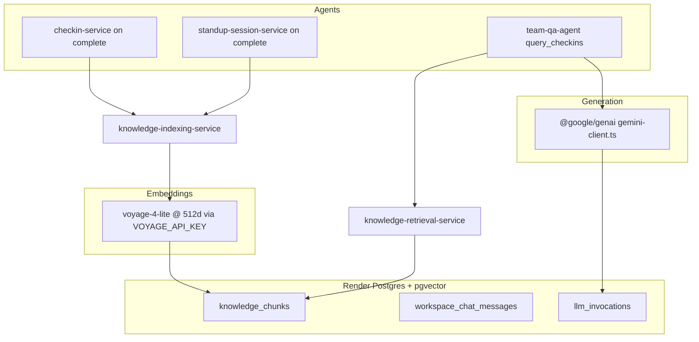

# Ceptly Intelligence Platform — Implementation Handoff

**Repos:** [`ceptly-backend`](/home/michaelehmke/Projects/ceptly-backend) (all AI/DB logic), [`ceptly2`](/home/michaelehmke/Projects/ceptly2) (UI + API proxy).

---

## 1. Current State (read before coding)

Ceptly is a **tool-augmented Gemini agent platform** — not RAG today.

| Layer | Today |
| ----- | ----- |
| **LLM** | Google Gemini only (`@google/genai`, default `gemini-2.5-flash`) via [`gemini-client.ts`](ceptly-backend/src/services/gemini-client.ts) |
| **Retrieval** | SQL + keyword filter in [`checkin-context-service.ts`](ceptly-backend/src/services/checkin-context-service.ts); no vectors |
| **DB** | Render Postgres + Drizzle; 19 tables; **no pgvector** |
| **Frontend** | No LLM keys; chat proxied via SSE |

### Agent map

| Product agent | Backend entry | Storage |
| ------------- | ------------- | ------- |
| `checkin` / `reachout` | [`agent-service.ts`](ceptly-backend/src/services/agent-service.ts) | `scheduled_conversations` + `checkin_sessions` + `checkin_messages` |
| `standup` | same | `standups` + `standup_sessions` + `standup_session_messages` |
| `team_qa`, `conversation_setup`, `adhoc_conversation`, `channel_standup` | [`workspace-chat-service.ts`](ceptly-backend/src/services/workspace-chat-service.ts) + [`chat-router.ts`](ceptly-backend/src/services/chat-router.ts) | **Not persisted** (React state / 24h TtlCache) |

### Ephemeral data (fix in this build)

- Founder `/chat` messages — React state only
- LLM usage — never logged

### Current retrieval (`query_checkins`)

[`team-qa-agent.ts`](ceptly-backend/src/services/team-qa-agent.ts) → `loadCheckinContextEntries()` → `entryMatchesKeyword()` substring match. **Standup transcripts not included.**

### Key generateContent call sites (~18 files)

`team-qa-agent.ts`, `checkin-conversation-agent.ts`, `standup-turn-service.ts`, `chat-router.ts`, `conversation-setup-agent.ts`, `adhoc-conversation-agent.ts`, `channel-standup-agent.ts`, `synthesis-service.ts`, `standup-synthesis-service.ts`, integration turn/finalize services.

---

## 2. Target Architecture



| Layer | Choice |
| ----- | ------ |
| **Embeddings** | Voyage `voyage-4-lite` @ 512d — do not use Gemini embeddings |
| **Generation** | Keep `@google/genai` unchanged |
| **Vectors** | pgvector on Render Postgres (`CREATE EXTENSION vector`) |

> **Done:** `VOYAGE_API_KEY` is set in Render (ceptly-api environment) and deployed.

**Do not self-host voyage-4-nano.** Hosted Voyage API only.

### Multi-tenancy (required)

All retrieval and indexing **must filter by `workspace_id` from auth context** — never from client body alone. No cross-tenant vector search.

---

## 3. RAG Design

| Component | Choice |
| --------- | ------ |
| Embedding | `voyage-4-lite` @ 512d |
| Vector store | pgvector on Render Postgres |
| Chunking | **One chunk per completed session**; skip if fewer than 3 messages |
| Retrieval | Hybrid: keyword first → semantic fallback; top-k=8 + metadata filters |
| Ingestion | On session `completed`; backfill script for history |

### Chunk types

```
1. session_summary — checkin or standup session
   content: reuse formatTranscriptEntry() from checkin-context-service.ts
   metadata: member_id, conversation_id, goal, status, dates

2. standup_summary — standup_sessions.summary_text when present
   metadata: standup_id, session_id, channel_id
```

### Indexing hooks

| Event | File | Trigger |
| ----- | ---- | ------- |
| Check-in complete | [`checkin-service.ts`](ceptly-backend/src/services/checkin-service.ts) `appendMessage()` | `status → completed` |
| Standup complete | [`standup-session-service.ts`](ceptly-backend/src/services/standup-session-service.ts) | session complete |
| Standup summary | [`standup-synthesis-service.ts`](ceptly-backend/src/services/standup-synthesis-service.ts) | after summary written |

### Retrieval integration

[`team-qa-agent.ts`](ceptly-backend/src/services/team-qa-agent.ts) `executeQueryCheckins()`:

1. Existing keyword path if `member_name` / `keyword` args match
2. If no results OR `semantic_query` provided → `searchKnowledge(workspaceId, query, filters)`
3. Fall back to keyword-only if Voyage unavailable

---

## 4. Database Migration (`0037_knowledge_platform.sql`)

```sql
CREATE EXTENSION IF NOT EXISTS vector;

CREATE TABLE knowledge_chunks (
  id UUID PRIMARY KEY DEFAULT gen_random_uuid(),
  workspace_id UUID NOT NULL REFERENCES workspaces(id) ON DELETE CASCADE,
  source_type TEXT NOT NULL, -- checkin_session | standup_session | standup_summary
  source_id UUID NOT NULL,
  chunk_index SMALLINT NOT NULL DEFAULT 0,
  content TEXT NOT NULL,
  embedding vector(512),
  metadata JSONB NOT NULL DEFAULT '{}',
  created_at TIMESTAMPTZ NOT NULL DEFAULT now(),
  UNIQUE (workspace_id, source_type, source_id, chunk_index)
);

CREATE INDEX idx_knowledge_chunks_workspace ON knowledge_chunks (workspace_id);
CREATE INDEX idx_knowledge_chunks_embedding ON knowledge_chunks
  USING ivfflat (embedding vector_cosine_ops) WITH (lists = 100);

CREATE TABLE workspace_chat_sessions (
  id UUID PRIMARY KEY DEFAULT gen_random_uuid(),
  workspace_id UUID NOT NULL REFERENCES workspaces(id) ON DELETE CASCADE,
  user_id UUID NOT NULL REFERENCES users(id),
  agent_id TEXT,
  created_at TIMESTAMPTZ NOT NULL DEFAULT now(),
  updated_at TIMESTAMPTZ NOT NULL DEFAULT now()
);

CREATE TABLE workspace_chat_messages (
  id UUID PRIMARY KEY DEFAULT gen_random_uuid(),
  session_id UUID NOT NULL REFERENCES workspace_chat_sessions(id) ON DELETE CASCADE,
  role TEXT NOT NULL CHECK (role IN ('user', 'assistant')),
  content TEXT NOT NULL,
  agent_id TEXT,
  proposal JSONB,
  created_at TIMESTAMPTZ NOT NULL DEFAULT now()
);

CREATE TABLE llm_invocations (
  id UUID PRIMARY KEY DEFAULT gen_random_uuid(),
  workspace_id UUID NOT NULL,
  agent_name TEXT NOT NULL,
  model TEXT NOT NULL,
  input_tokens INT,
  output_tokens INT,
  latency_ms INT,
  source_type TEXT,
  source_id UUID,
  created_at TIMESTAMPTZ NOT NULL DEFAULT now()
);
```

Drizzle schemas: `src/db/schema/knowledge-chunk.ts`, `workspace-chat-session.ts`, `workspace-chat-message.ts`, `llm-invocation.ts`. Follow existing patterns in [`src/db/schema/`](ceptly-backend/src/db/schema/).

---

## 5. New Services

```
ceptly-backend/src/services/
  voyage-embedding-service.ts      # embedText(), embedBatch() — Voyage API
  knowledge-indexing-service.ts    # indexCheckinSession(), indexStandupSession(), indexStandupSummary()
  knowledge-retrieval-service.ts   # searchKnowledge(), formatKnowledgeResults()
  knowledge-types.ts               # interfaces below
  llm-telemetry-service.ts         # logInvocation()
```

### TypeScript interfaces

```typescript
// knowledge-types.ts

export type KnowledgeSourceType =
  | "checkin_session"
  | "standup_session"
  | "standup_summary";

export interface KnowledgeChunkMetadata {
  member_name?: string;
  member_id?: string;
  conversation_name?: string;
  conversation_id?: string;
  session_status?: string;
  session_started_at?: string;
  session_completed_at?: string;
  goal?: string;
}

export interface KnowledgeSearchFilters {
  sourceTypes?: KnowledgeSourceType[];
  memberId?: string;
  memberName?: string;
  days?: number;
  status?: "completed" | "in_progress" | "abandoned";
}

export interface KnowledgeSearchResult {
  chunkId: string;
  content: string;
  score: number;
  metadata: KnowledgeChunkMetadata;
  sourceType: KnowledgeSourceType;
  sourceId: string;
}
```

### Env vars (wire in [`env.ts`](ceptly-backend/src/config/env.ts))

```
VOYAGE_API_KEY          # ✅ already set + deployed on Render (ceptly-api)
GEMINI_API_KEY          # existing
GEMINI_MODEL            # existing, default gemini-2.5-flash
```

Implementer: wire `VOYAGE_API_KEY` in code — do not add to Render.

---

## 6. API Contracts

```
POST /api/workspaces/:workspaceId/knowledge/search
  body: { query: string, filters?: KnowledgeSearchFilters, limit?: number }
  response: { results: KnowledgeSearchResult[] }

POST /api/workspaces/:workspaceId/knowledge/reindex
  body: { source_type?: string }  // admin only; triggers backfill

GET  /api/workspaces/:workspaceId/chat/sessions
GET  /api/workspaces/:workspaceId/chat/sessions/:sessionId
```

---

## 7. `query_checkins` changes

Add to `QUERY_CHECKINS_DECLARATION.parametersJsonSchema.properties`:

```typescript
semantic_query: {
  type: "string",
  description: "Natural language search over check-ins and standups.",
},
```

In `executeQueryCheckins()`:

```typescript
if (typeof args.semantic_query === "string" && args.semantic_query.trim()) {
  const results = await searchKnowledge(workspaceId, args.semantic_query, {
    days: typeof args.days === "number" ? args.days : 30,
    memberName: typeof args.member_name === "string" ? args.member_name : undefined,
    includeInProgress: args.include_in_progress === true,
  });
  if (results.length > 0) return formatKnowledgeResults(results);
}
// existing keyword path unchanged
```

---

## 8. Build Tasks

| # | Task | Files |
| - | ---- | ----- |
| 1 | pgvector migration + Drizzle schemas | `drizzle/0037_*.sql`, `src/db/schema/` |
| 2 | `voyage-embedding-service.ts` | new; `VOYAGE_API_KEY` already on Render |
| 3 | `knowledge-indexing-service.ts` + backfill | `scripts/backfill-knowledge-index.ts` |
| 4 | Semantic `query_checkins` | `team-qa-agent.ts` |
| 5 | Index standup transcripts + summaries | `standup-session-service.ts`, `standup-synthesis-service.ts` |
| 6 | Persist workspace chat | `workspace-chat-service.ts`, `routes/workspace-chat.ts`, `ceptly2/components/employee-chat-prompt.tsx` |
| 7 | LLM telemetry wrapper | `gemini-client.ts`, `llm-telemetry-service.ts` |

**Exit criteria:**

- `semantic_query: "deployment blockers"` returns relevant sessions without exact keyword
- Workspace chat survives page refresh
- Row in `llm_invocations` per `generateContent` call
- All vector queries scoped to authenticated `workspace_id`

---

## 9. Claude Code Prompt

**Context:** Ceptly backend at `/home/michaelehmke/Projects/ceptly-backend` — Gemini agents, Postgres transcripts, no vectors. Frontend at `/home/michaelehmke/Projects/ceptly2` proxies chat via SSE.

**Implement:**

1. Migration `0037_knowledge_platform.sql` — tables in §4
2. `voyage-embedding-service.ts`, `knowledge-indexing-service.ts`, `knowledge-retrieval-service.ts`, `knowledge-types.ts`
3. Backfill `checkin_messages` + `standup_session_messages`
4. Upgrade `query_checkins` — semantic + keyword fallback (§7)
5. Persist workspace chat in `workspace-chat-service.ts`; wire frontend session load
6. Wrap `generateContent` in `gemini-client.ts` → `llm_invocations`

**Constraints:**

- Voyage API for embeddings (`VOYAGE_API_KEY` — **already configured on Render**; wire in code only)
- Drizzle patterns from existing `src/db/schema/`
- Match existing service/route conventions
- Surgical diffs — no unrelated refactors
- Index on session complete only, not every message
- **Every retrieval/index query filters `workspace_id` from auth**

**Read first:**

- `src/services/checkin-context-service.ts`
- `src/services/team-qa-agent.ts`
- `src/services/checkin-service.ts`
- `src/services/standup-session-service.ts`
- `src/services/workspace-chat-service.ts`
- `src/services/gemini-client.ts`

**Out of scope:** memory system, feedback UI, eval harness, document upload, Anthropic provider, re-ranker, check-in pre-fetch RAG.
